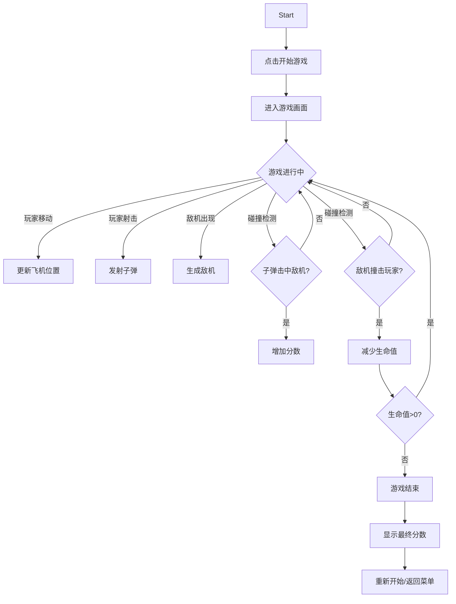

## 1. Product Overview
经典飞机大战射击游戏，玩家控制战机躲避敌机并发射子弹消灭敌人，获取高分。
- 提供休闲娱乐体验，简单易上手
- 适合各年龄段用户，具有较高的可玩性和挑战性

## 2. Core Features

### 2.1 User Roles
| Role | Registration Method | Core Permissions |
|------|---------------------|------------------|
| Player | None | Play game, view score |

### 2.2 Feature Module
1. **游戏主界面**: 开始按钮、游戏画布、分数显示、生命值
2. **游戏控制**: 键盘/触摸控制飞机移动和射击
3. **敌人生成系统**: 随机生成不同类型敌机
4. **碰撞检测**: 子弹与敌机、敌机与玩家碰撞检测
5. **计分系统**: 击杀敌机获得分数

### 2.3 Page Details
| Page Name | Module Name | Feature description |
|-----------|-------------|---------------------|
| 游戏界面 | 主菜单 | 显示游戏标题、开始按钮 |
| 游戏界面 | 游戏区域 | Canvas画布，显示玩家飞机、敌机、子弹 |
| 游戏界面 | HUD | 显示分数、生命值、游戏状态 |

## 3. Core Process

## 4. User Interface Design

### 4.1 Design Style
- **配色方案**: 深蓝色天空背景，白色飞机，红色敌机，黄色子弹
- **视觉风格**: 复古像素风格，现代扁平化设计结合
- **按钮样式**: 圆角矩形，渐变色填充，悬停效果
- **字体**: 像素风格字体或现代无衬线字体

### 4.2 Page Design Overview
| Page Name | Module Name | UI Elements |
|-----------|-------------|-------------|
| 游戏界面 | 主菜单 | 居中标题、开始按钮、游戏说明 |
| 游戏界面 | 游戏画布 | 全屏Canvas，动态背景星星 |
| 游戏界面 | HUD | 左上角分数显示、右上角生命值 |

### 4.3 Responsiveness
- 桌面端: 键盘控制(方向键/WASD移动，空格射击)
- 移动端: 触摸控制(滑动移动，点击射击)
- 自适应画布大小

### 4.4 游戏元素设计
- **玩家飞机**: 白色战斗机造型，带有引擎火焰动画
- **敌机**: 红色敌方战斗机，不同尺寸代表不同血量
- **子弹**: 黄色圆形子弹，带有拖尾效果
- **爆炸效果**: 粒子消散动画