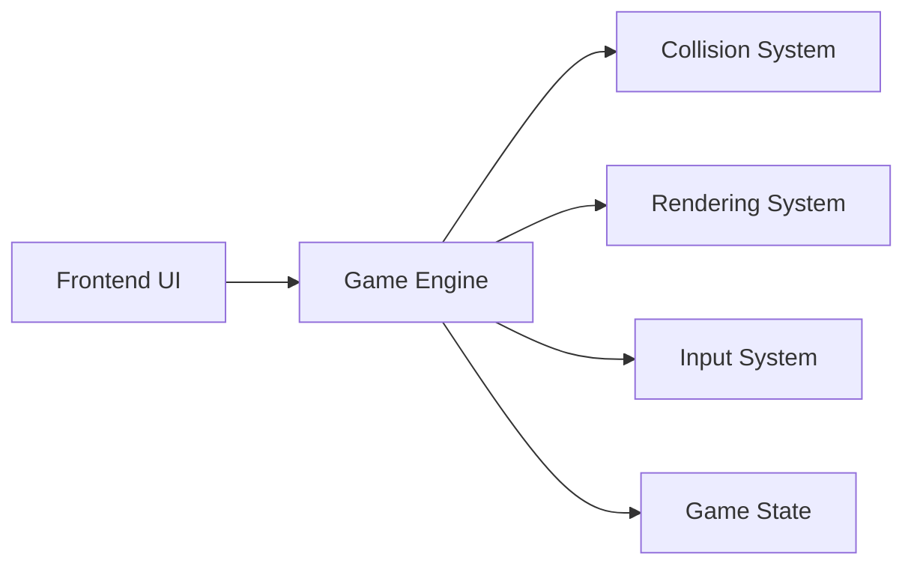
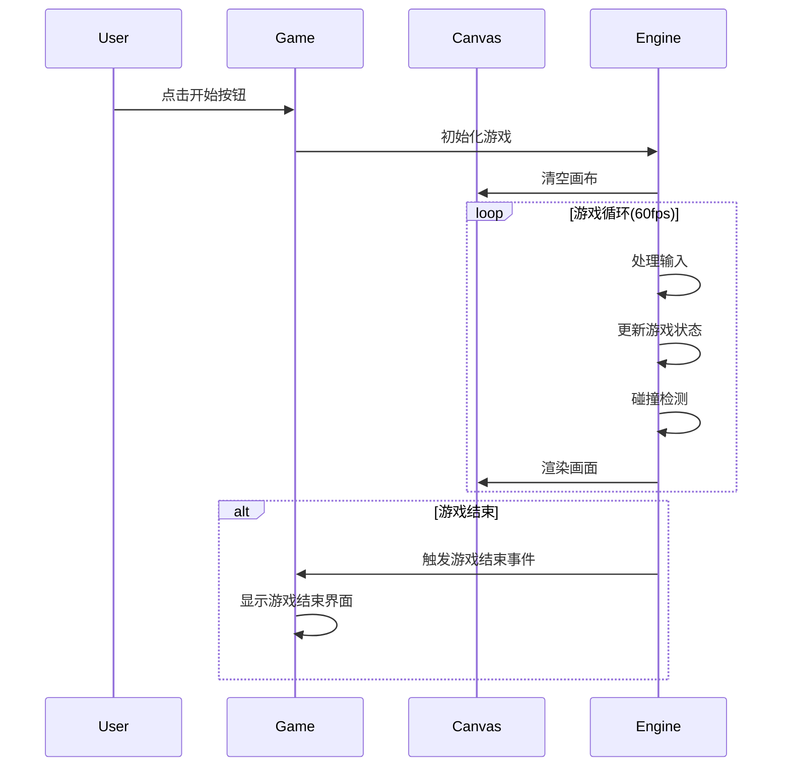

## 1. Architecture Design


## 2. Technology Description
- Frontend: React@18 + TypeScript + vite
- Styling: TailwindCSS@3
- Game Rendering: HTML5 Canvas API
- Initialization Tool: vite-init

## 3. Route Definitions
| Route | Purpose |
|-------|---------|
| / | 游戏主页面 |

## 4. Component Structure
```
src/
├── components/
│   ├── Game.tsx          # 游戏主组件
│   ├── GameCanvas.tsx    # Canvas画布组件
│   ├── StartMenu.tsx     # 开始菜单
│   ├── GameOver.tsx      # 游戏结束界面
│   └── HUD.tsx           # 游戏信息显示
├── hooks/
│   └── useGameLoop.ts    # 游戏循环hook
├── game/
│   ├── Player.ts         # 玩家飞机类
│   ├── Enemy.ts          # 敌机类
│   ├── Bullet.ts         # 子弹类
│   ├── Explosion.ts      # 爆炸效果类
│   ├── Star.ts           # 背景星星类
│   └── GameEngine.ts     # 游戏引擎核心
├── types/
│   └── game.ts           # 类型定义
└── App.tsx
```

## 5. Core Classes

### 5.1 Player Class
| Property | Type | Description |
|----------|------|-------------|
| x | number | 玩家X坐标 |
| y | number | 玩家Y坐标 |
| width | number | 飞机宽度 |
| height | number | 飞机高度 |
| speed | number | 移动速度 |
| health | number | 生命值 |
| isInvincible | boolean | 是否无敌 |

### 5.2 Enemy Class
| Property | Type | Description |
|----------|------|-------------|
| x | number | 敌机X坐标 |
| y | number | 敌机Y坐标 |
| width | number | 敌机宽度 |
| height | number | 敌机高度 |
| speed | number | 移动速度 |
| health | number | 生命值 |
| type | string | 敌机类型(普通/精英/Boss) |
| score | number | 击杀得分 |

### 5.3 Bullet Class
| Property | Type | Description |
|----------|------|-------------|
| x | number | 子弹X坐标 |
| y | number | 子弹Y坐标 |
| width | number | 子弹宽度 |
| height | number | 子弹高度 |
| speed | number | 飞行速度 |
| isPlayerBullet | boolean | 是否玩家子弹 |

## 6. Game Flow


## 7. Input Handling
| Key | Action |
|-----|--------|
| Arrow Up/W | 向上移动 |
| Arrow Down/S | 向下移动 |
| Arrow Left/A | 向左移动 |
| Arrow Right/D | 向右移动 |
| Space | 发射子弹 |

## 8. Collision Detection
- 使用AABB碰撞检测算法
- 子弹与敌机碰撞 → 敌机受伤，子弹消失
- 敌机与玩家碰撞 → 玩家受伤，敌机消失
- 玩家受伤后短暂无敌